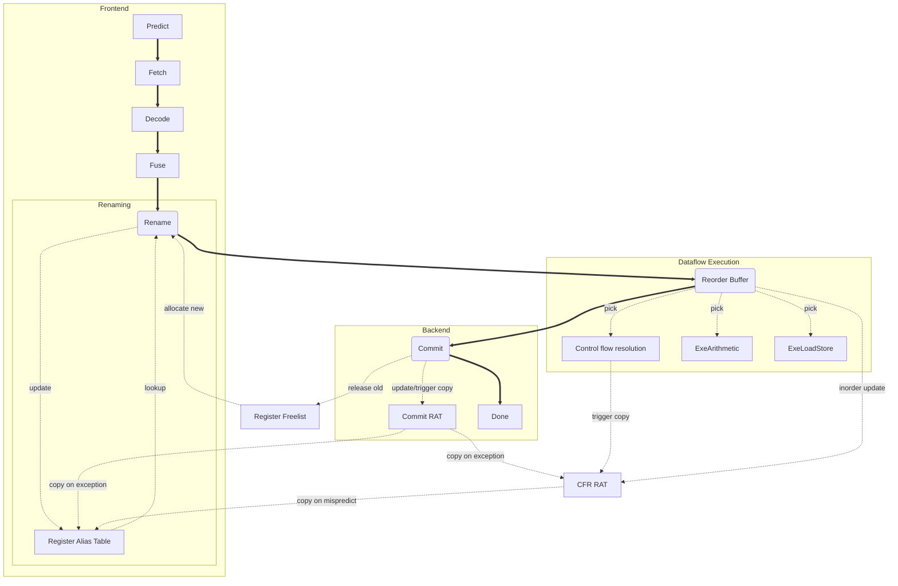

## Dynamisk Skedulering (Out-of-order execution)

Alle moderne højtydende processor-kerner har samme grundlæggende design som præsenteres
nedenfor. Præsentationen her har til formål at gøre performance overvejelser
(primært omkostningen ved fejlforudsagte hop) meningsfuld, så vi vil se bort fra
mange detaljer.

### Overordnet struktur (mikroarkitektur)

Mikroarkitekturen i en højtydende processor er delt i tre overordnede sektioner:

* En "forende" som skaffer instruktioner og klargør dem til udførelse. Det gøres i programrækkefølge.
* En "bagende" som tjekker resultater for fejl (exceptions) og griber ind hvis noget er gået galt. Det gøres ligeledes i programrækkefølge
* En "dataflow-del" som udfører instruktionerne i en rækkefølge bestemt af deres dataafhængigheder.

Instruktionerne begynder deres vej i den forreste del af mikroarkitekturen, der 
indeholder allerede kendte elementer som forudsigelse, hentning og afkodning. 
Efter afkodning udføres *fusionering* og *registeromdøbning* som beskrives nærmere nedenfor.
Når instruktionerne har gennemført registeromdøbning kan de udføres i dataflow rækkefølge,
dvs i en rækkefølge bestemt af deres indbyrdes afhængigheder men uden at respektere
deres oprindelige rækkkefølge i programmet. Moderne processor-kerner har plads til
flere hundrede instruktioner i deres dataflow sektion. Slutteligt tjekkes instruktionerne
for fejlsituationer i den oprindelige programrækkefølge. Hvis en fejl er opstået
og der skal udføres en *exception* ("undtagelse?"), kan maskinen annullere alle instruktioner 
der kommer logisk *efter* den fejlende instruktion. Det giver illusionen af at alt er udført
i programrækkefølge.

Figuren nedenfor illustrerer en moderne out-of-order mikroarkitektur

### Forudsigelse og instruktionshentning

I beskrivelsen af simplere pipelines foretager man først instruktionshentning. De
hentede instruktioner afkodes dernæst så hop/kald/retur identificeres. Derpå forudsiges
programforløbet. Som nævnt tidligere kan en branch target buffer levere forudsigelser
lidt tidligere.

I en moderne mikroarkitektur kan man ligeså godt vende beskrivelsen på hovedet:
Forudsigelser gøres *uden* afkodning af instruktioner. Maskinen "lærer" control-flow-grafen
for programmet. Indlæring foretages når forudsigelser enten bekræftes eller afvises.
Forudsigelser baseres på det indlærte og driver instruktionshentning. Med andre ord
kommer forudsigelse før instruktionshentning.

I praksis har det ikke nogen betydning for vores afviklingsplot fordi hverken forudsigelse
eller indlæring forlænger pipelinen. "Indlæring"
sker samtidigt med andre aktiviteter og "ses" derfor ikke. Selvom forudsigelsen logisk
set sker tidligt, før instruktionshentning, så kan den heller ikke "ses" fordi en
fejlforudsigelse omdirigerer instruktionshentning uden forsinkelse - dvs omdirigeringen
skal ikke først pasere i gennem et eller flere trin der laver forudsigelser.

I det følgende vil vi antage at vi kan forudsige en hop/kald/retur pr maskin-cyklus,
og udelade selve forudsigelsen fra vores "flow" beskrivelse, der derfor stadig
vil starte med de tre trin Fa, Fb og Fc.

### Fusionering

I de fleste maskinsprog er der bestemte instruktionssekvenser som med fordel kan omskrives
til en enkelt instruktion på hardware niveau. For eksempel har IA64 ikke nogen compare-and-branch
instruktion som RISC-V, men må bruge to separate instruktioner for henholdsvis sammenligning
og betinget hop. De to instruktioner fusioneres almindeligvis til en compare-and-branch.

Det er (ofte) en forudsætning for at fusionere to instruktioner:

 * At de har samme destinations register
 * At den sidste afhænger af den første
 * At de tilsammen max har to kilderegistre og en immediate
 * At de tilsammen kan udføres i et hug længere nede i pipelinen

RISC-V har (mindst) to sekvenser som med fordel kan fusioneres:

 * lui efterfulgt af addi. (Tilsammen udgør de pseudo-instruktionen "li")
 * add efterfulgt af load/store. Det er billigt at bygge AGUen (address generate unit) 
så den kan addere *tre* tal, to registre og et konstant offset
for at forme en adresse, men RISC-V har ikke nogen instruktion der matcher.

Fusionering kræver typisk et eller to trin oven i afkodning. Vi antager et trin og
markerer det med Fu i vores "flow" beskrivelse.

### Registeromdøbning 

Vi skelner mellem *logiske* og *fysiske* registre. På maskinsprogsniveau er (mellem)resultater 
placeret i logiske registre. Det er de registernumre en compiler bruger, når den oversætter
til assembler. I en simpel mikroarkitektur svarer hvert logisk register til *et*
*fysisk* register. I en out-of-order maskine er det mere kompliceret. 

En out-of-order maskine skal kunne håndtere mange instruktioner
som potentielt skriver til samme logiske register og mange instruktioner som læser
fra samme logiske register men på forskellige tidspunkter. For at kunne holde styr
på de mange resultater/registre der er i brug samtidigt udføres "registeromdøbning"
(eng: register renaming). Registeromdøbning er en teknik der sikrer at forskellige 
instruktioner der skriver til samme logiske register i stedet vil skrive til hver
deres *fysiske register.* Registeromdøbning sikrer også at læsere af et givet logisk
register vil læse det korrekte fysiske register.

Nedesntående figur viser hvordan registeromdøbning indgår i mikroarkitekturen. 
Instruktionerne følger de tykke sorte pile. Registerreferencerne følger de tynde
pile.

Registeromdøbning udføres ved hjælp af en omdøbningstabel, "Register Alias Table" eller "RAT". 
Denne tabel associerer hvert logisk registernummer med et fysisk registernummer. 
Instruktionens logiske kilde-registre slås op i tabellen og de tilsvarende fysiske registre følger
med instruktionen videre frem i maskinen. Sluttelig allokeres et fysisk destinationsregister
fra en friliste og omdøbningstabellen opdateres så den afspejler den nye binding fra
logisk til fysisk registernummer.

En typisk implementation bruger en cirkulær buffer til at holde såvel frilisten som
listen over allokerede destinationsregistre. En "tæller" indikerer allokeringspunkt
og allokering af fysiske registre sker ved at justere tælleren.

Instruktionerne slutter deres liv i "bagenden" af mikroarkitekturen. Her findes endnu
en omdøbningstabel, "Commit RAT", som holder afbildningen fra logisk til fysisk register
for den ældste instruktion. Endnu en tæller holder rede på hvor den ældste instruktion
befinder sig i bufferen. Den ældste instruktion *fuldføres* (eng: commits, retires)
ved at dens tidligere fysiske destinations register læses fra "Commit RAT"
og indsættes i frilisten. Derpå opdateres "Commit RAT" til det nye fysiske
destinationsregister for instruktionen.

Omdøbning tager typisk et eller to trin, afhængigt af hvor mange instruktioner der
skal behandles samtidigt. Vi antager to trin som vi markerer med "Al" (allocate) og
"Rn" (rename) i vores "flow" beskrivelse.

### Registeromdøbning og exceptions

Hvis en instruktion fejler (f.eks. tilgår reserveret lager, dividerer med nul) skal
maskinen reagere ved at kalde en "exception handler." Moderne
maskiner understøtter *præcise* exceptions: Herved forstås at en exception ses som
associeret med *en* bestemt fejlende instruktion. Alle tidligere instruktioner vil være udført og
alle efterfølgende vil ikke være udført. I en simpel pipeline kan dette sikres ved at
have Wb trinnet *efter* det trin hvor fejl detekteres. I en out-of-order maskine
med hundredevis af instruktioner i forskellige stadier af udførelse skal der andre
boller på suppen.

Registeromdøbning er designet til at understøtte præcise "exceptions" som følger:
Hvis en instruktion fejler, så markeres den blot som fejlet men iøvrigt fortsætter
udførelsen. Instruktionshentning stopper dog omgående og afventer. Når den fejlende
instruktion er blevet den ældste instruktion og når til commit-trinnet så aborteres alle andre
instruktioner og omdøbningstabellen i commit (Commit RAT) kopieres til omdøbningstabellen
i forenden af pipelinen (RAT). Endeligt returneres de fysiske destinationsregistre
for de aborterede instruktioner til frilisten. Som nævnt tidligere implementeres
friliste og listen over allokerede fysiske registre med en cirkulær buffer og frigivelse
kan gøres ved at sætte tælleren for allokering så den svarer til tælleren for
frigivelse. 

### Registeromdøbning og fejl-Forudsigelser

Håndtering af fejl-forudsigelser minder om håndtering af exceptions, men der er andre
krav til ydeevnen. Fejl-forudsigelser forekommer langt hyppigere og skal derfor håndteres
hurtigere. Det er ikke godt nok at vente til et fejl-forudsagt hop bliver den ældste
instruktion og når commit-trinnet.

For at kunne reagere hurtigere implementeres en mekanisme som fungerer analogt til
commit, men kun begrænses af de betingede instruktioner, der endnu ikke er blevet afgjort.
(Det vil sige: den ignorerer fejlende instruktioner)
Mekanismen scanner instruktionerne og de allokerede fysiske destinationsregistre i 
programrækkefølge og opdaterer endnu en omdøbningstabel (CFR RAT). Denne RAT repræsenterer
maskinens tilstand ved den nyeste (i programforløbet) endnu ikke afgjorte betingelse. 
Hvis denne nyeste ikke afgjorte betingelse viser sig at være fejlforudsagt, så kopieres
CFR RAT til RAT, yngre instruktioner aborteres og deres allokerede destinationsregistre
returneres til frilisten. Samtidigt omdirigeres instruktionshentning til den korrekte
adresse. Fordi det tager tid at fylde forenden af mikroarkitekturen kan omkostningen
ved at opdatere RATs, frilister osv skjules. Fra et performance-perspektiv gælder
stadig at første fase af instruktions-hentning kan ske i maskincyklen umiddelbart
efter et betinget hop afgøres som fejlforudsagt.

### Overførsel til dataflow sektionen

Efter renaming overføres instruktioner til et særlig lager i dataflow sektionen, som
beskrives nedenfor. Skrivning til dette lager kan involvere kompliceret allokering
af plads og tager et pipeline-trin. Vi markerer det med "Qu" (Queue) i vores flow beskrivelse.

### Fuldførelse (bagende)

Når en instruktion er udført uden fejl og blevet den ældste "fuldføres" den ved at
"Commit RAT" omdøbningstabellen opdateres og det fysiske register associeret med den
nye instruktions logiske register returneres til frilisten. Det tager to pipeline trin,
som markeres med "Ca" og "Cb" i vores flow beskrivelse

### Opsamling af instruktions-"flow" for forende og bagende

Vi kan nu give en beskrivelse af in-order delene af en out-of-order mikroarkitektur i form
af et (ufuldendt) "flow" for instruktionerne.

~~~
alle: Fa Fb Fc De Fu Al Rn Qu ...out-of-order... Ca Cb
~~~

Fusionering af to instruktioner markeres ved at den første af dem holder op med at
eksistere i efter "Fu" i afviklingsplottet.

### Dataflow baseret udførelse

Når instruktionerne er paseret gennem forenden af mikroarkitekturen når de dataflow-sektionen,
hvor de indsættes i en "scheduler". Scheduleren består af to halvdele som udgør en
feedback sløjfe der hver cyclus udvælger instruktioner til udførelse. De to halvdele
er:

 * Wakeup. Hver cycle signaleres hvilke fysiske registre der har fået skrevet en værdi.
Det sammenlignes for hver instruktion i lageret med instruktionens fysiske kilderegistre.
Når en instruktion har "set" alle sine kilderegister markeres den som "vågen".
 * Pick. Flere instruktioner kan være vågne samtidig, og så skal der vælges i mellem
dem. Oftest anvendes en tilnærmelse til "ældste først". Når instruktionerne er udvalgt
kan deres fysiske destinationsregistre tilføjes til mængden af "skrevne" værdier i
den følgende maskincyklus - eller senere, alt afhængig af de valgte instruktioners
latenstid. En single-cycle ALU operation har en latenstid på 1, mens en load instruktion
(jvf tidligere diskussion) har en latenstid på 4.

I nogle maskiner er der mange små schedulere, som hver udvælger en instruktion, i andre
er der færre schedulere som hver især kan udvælge flere instruktioner.

Bemærk at da schedulering foretages flere pipeline trin før udførelse, så er den af
natur spekulativ og baseret på antagelser om latenstider og vil fejle hvis en instruktion 
har en anden latenstid end antaget, for eksempel ved et cache-miss. Vi vil ikke gå ind 
i hvordan systemet håndterer en sådan "fejlschedulering".

Når en instruktion er udvalgt skal den læse operander fra de fysiske kilde-registre
før den endelig kan udføres og slutteligt skrive sit resultat til et fysisk destinationsregister.
Der er mange fysiske registre, så læsning og skrivning kræver en fuld maskin cyklus hver.

De nye pipeline trin i dataflow-sektionen er:

 * pk: "pick". Udvælgelse af en instruktion til udførelse. Kaldes nogle gange "instruction issue"
 * rd: "read". Læsning af operander fra registre (eller overførsel via forwarding)
 * ex: "execute". Selve operationen udføres i en ALU
 * wr: "write". Resultatet skrives til et register

For hop og aritmetiske instruktioner (excl mul) ender vi med følgende "flow" beskrivelse:

~~~
ALU-op: Fa Fb Fc De Fu Al Rn Qu pk rd ex wr Ca Cb
branch: Fa Fb Fc De Fu Al Rn Qu pk rd ex Ca Cb

inorder: Fa,Fb,Fc,De,Fu,Al,Rn,Qu,Ca,Cb
outoforder: pk,rd,ex,wr
~~~

Vi kan nu (omsider) se hvad et fejlforudsagt hop koster (i vores maskine). 
"Fa" for instruktionen efter hoppet kan tidligst ligge i cyklen efter "ex" for det 
fejlforudsagte hop. Det giver en "branch mispredict penalty" på 11 maskincykler.

Typiske tal for moderne mikroarkitekturer er 10-15 maskincykler.

### Lagerreferencer

Håndtering af lagerreferencer er den mest komplicerede del af en moderne mikroarkitektur.
Formodentlig cirka ligeså omfattende som alle de øvrige elementer til sammen. Så "brace for impact!"

Vi starter blidt: skrivning til lageret må ikke foregå spekulativt. En store instruktion
kan ikke opdatere lageret før den har nået "commit" og vi ved med sikkerhed at den
virkeligt skal fuldføres. Ergo må skrivninger holdes tilbage i en kø, analogt til
køen af allokerede destinationsregistre. Denne kø kaldes en store-kø.

Store-køen indeholder store instruktioner i programrækkefølge og for hver instruktion
følgende data:

 * Adresse.
 * Er adressen gyldig?
 * Data
 * Er data gyldig - dette angives pr byte

Vi allokerer pladser i store-køen i rename-trinnet. Bemærk at en store instruktion
udføres i to faser - fase et er beregning af adressen, som derpå skrives i det relevante
felt i store-køen. Fase to er overførsel af den værdi der skal skrives til det relevante
felt i store-køen. Faserne vil ofte blive skeduleret separat så fase to kan i nogle 
maskiner ske før fase et.

For både load og store instruktioner startes cache opslag så snart deres adresse er
beregnet. Men store instruktioner skriver ikke deres data til cachen i første omgang.
Opslaget foretages for at trigge eventuelle TLB miss og cache miss. Opdatering af
cachen sker først senere når store instruktionen bliver den ældste i store-køen og når
til commmit-trinnet.

Når en load instruktion har
beregnet den adresse den skal tilgå, sammenlignes adressen med alle ældre store instruktioner
i store-køen (vi ignorerer her hvordan der holdes rede på instruktioners "alder").
Der kan være flere matchende store instruktioner.

Dernæst bestemmes, separat for hver byte der refereres, hvilken matchende store instruktion der
er nyest. Fra den store instruktion overføres den relevante byte til load instruktionen.
Bemærk at for hver byte kan der være en sådan nyeste store instruktion eller ej - i 
sidste tilfælde hentes den relevante byte i stedet fra datacachen.

Hele denne process udføres parallelt med opslaget i datacachen og er derfor almindeligvis
"skjult" - latenstiden matcher opslaget i cachen.

Det vil forekomme at load instruktioner søger i store-køen og rammer en store hvis
adresse endnu ikke er beregnet. Denne situation kan håndteres på flere måder:

 * konservativt: load instruktionen må vente. Det viser sig at give meget dårlig ydeevne.
 * aggressivt: ignorer problemet, udfør load på basis af tilgængelige data. tjek efter senere
 * typisk: brug en forudsiger (alias-predictor), tjek senere.

Under alle omstændigheder er det nødvendigt at placere load instruktionerne i en load-kø.
Når en store instruktion har beregnet sin adresse og modtaget den værdi der skal stores, 
foretager den en sammenligning med instruktionerne i load-køen. Matchende yngre 
load-instruktioner "vækkes" og derpå genkøres søgeprocessen for de vækkede load-instruktioner, 
så de får en chance for at få et korrekt resultat.

Når vi konstruerer vores afviklingsplot vil vi nøjes med at modellere cache-tilgangen
og se bort fra de mulige forsinkelser der kan opstå på grund af aliasing.

Det giver os følgende "flow" for load og store:

~~~
load:  Fa Fb Fc De Fu Al Rn Qu pk rd ag ma mb mc wr Ca Cb
store: Fa Fb Fc De Fu Al Rn Qu pk rd ag ma mb mc Ca Cb

outoforder: pk,rd,ex,ag,ma,mb,mc,wr
~~~

Vi viser ikke den afsluttende skrivning fra store instruktioner til cachen der finder
sted som led i commit.

### Et samlet billede

Vi kan nu (omsider) give et samlet billede af hvordan en out-of-order maskine udfører
en programstump. Betragt følgende eksempel fra tidligere:

~~~
while (ptr < limit) { sum += *ptr++; }
~~~

To gennemløb:

~~~
						0  1  2  3  4  5  6  7  8  9  0  1  2  3  4  5  6  7  8
0:  lw x11,0(x10)		Fa Fb Fc De Fu Al Rn Qu pk rd ag ma mb mc wr Ca Cb
4:  add x10,x10,4		Fa Fb Fc De Fu Al Rn Qu pk rd ex wr -- -- -- Ca Cb
8:  add x12,x12,x11		Fa Fb Fc De Fu Al Rn Qu -- -- -- -- pk rd ex wr Ca Cb
C:  bne x10,x13,0		Fa Fb Fc De Fu Al Rn Qu -- pk rd ex -- -- -- -- Ca Cb
0:  lw x11,0(x10)		   Fa Fb Fc De Fu Al Rn Qu pk rd ag ma mb mc wr Ca Cb
4:  add x10,x10,4		   Fa Fb Fc De Fu Al Rn Qu pk rd ex -- -- -- -- Ca Cb
8:  add x12,x12,x11		   Fa Fb Fc De Fu Al Rn Qu -- -- -- -- pk rd ex wr Ca Cb
C:  bne x10,x13,0		   Fa Fb Fc De Fu Al Rn Qu -- pk rd ex wr -- -- -- Ca Cb
~~~

På denne kodestump opnås en IPC på 4.

Bemærk forskellen fra den in-order superskalare præsenteret tidligere. For den maskine
var IPC for samme kodestump kun 1.
